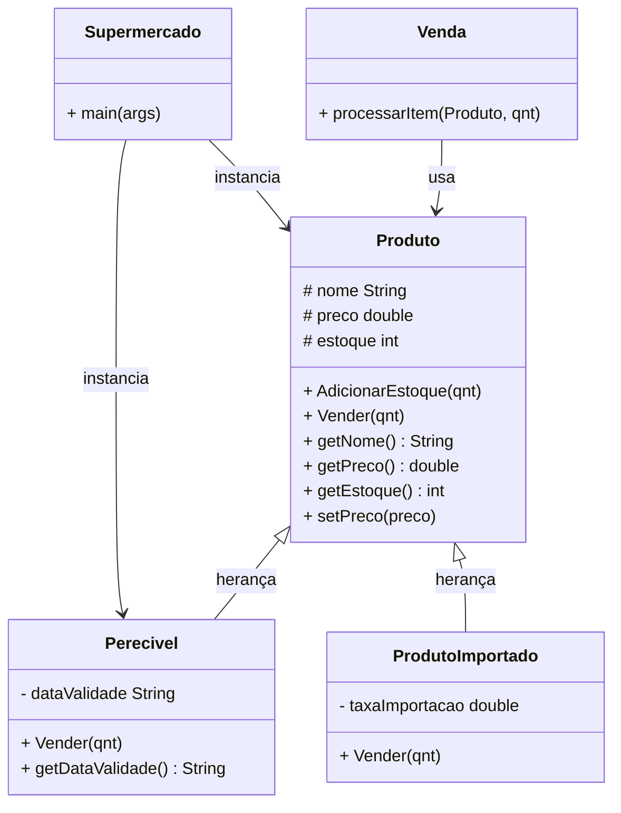

# 🛒 Supermarket System

> Sistema orientado a objetos em Java para gerenciamento de produtos e vendas de um supermercado.

---

## 📋 Sobre o Projeto

O **Supermarket System** é um projeto acadêmico desenvolvido em Java que aplica os conceitos de **Programação Orientada a Objetos (POO)**, como herança, polimorfismo e encapsulamento, para simular o funcionamento de um supermercado.

---

## 🏗️ Diagrama de Classes



---

## 📁 Estrutura do Projeto

```
Supermaket/
├── src/
│   └── com/unifsa/Supermaket/
│       ├── Produto.java
│       ├── Perecivel.java
│       ├── ProdutoImportado.java
│       ├── Venda.java
│       └── Supermercado.java
```

---

## 🧩 Classes

### `Produto` — Classe Base
Representa um produto genérico do supermercado.

| Atributo | Tipo | Descrição |
|---|---|---|
| `nome` | `String` | Nome do produto |
| `preco` | `double` | Preço unitário |
| `estoque` | `int` | Quantidade em estoque |

**Métodos:**
- `AdicionarEstoque(int qnt)` — Incrementa o estoque
- `Vender(int qnt)` — Realiza a venda e atualiza o estoque

---

### `Perecivel` — Herda de `Produto`
Produto com data de validade. Verifica a validade antes de vender.

| Atributo | Tipo | Descrição |
|---|---|---|
| `dataValidade` | `String` | Data de vencimento do produto |

**Sobrescreve:** `Vender(int qnt)` — exibe verificação de validade antes de processar a venda.

---

### `ProdutoImportado` — Herda de `Produto`
Produto com taxa de importação aplicada no valor final da venda.

| Atributo | Tipo | Descrição |
|---|---|---|
| `taxaImportacao` | `double` | Taxa adicional aplicada ao preço |

**Sobrescreve:** `Vender(int qnt)` — calcula e exibe o valor final com a taxa de importação.

---

### `Venda`
Responsável por processar itens de uma venda, calculando o valor total.

- `processarItem(Produto p, int qnt)` — Calcula `qnt × preco` e exibe o total.

---

### `Supermercado`
Classe principal com o método `main`. Ponto de entrada da aplicação.

---

## ⚙️ Conceitos de POO Aplicados

| Conceito | Onde é aplicado |
|---|---|
| **Herança** | `Perecivel` e `ProdutoImportado` herdam de `Produto` |
| **Polimorfismo** | Método `Vender()` sobrescrito nas subclasses |
| **Encapsulamento** | Atributos `protected`/`private` com getters/setters |
| **Abstração** | Classe `Produto` como modelo base genérico |

---

## 🛠️ Tecnologias


---

## 🚀 Como Executar

### Pré-requisitos
- Java JDK 8 ou superior
- IntelliJ IDEA (recomendado)

### Passos

```bash
# Clone o repositório
git clone https://github.com/seu-usuario/supermarket-system.git

# Abra no IntelliJ IDEA
# File → Open → selecione a pasta do projeto

# Execute a classe principal
# Clique com botão direito em Supermercado.java → Run
```


